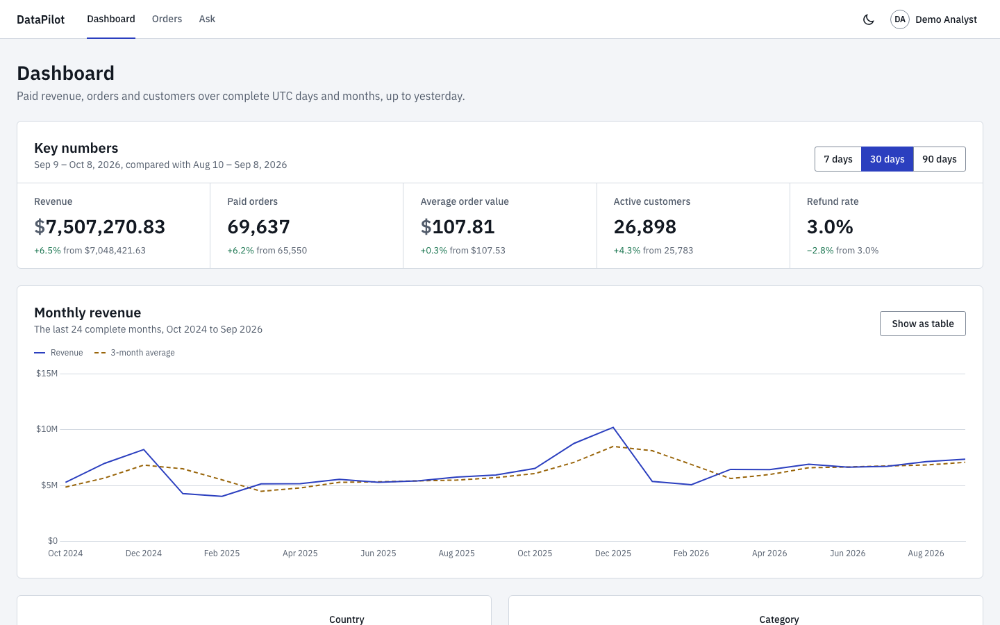
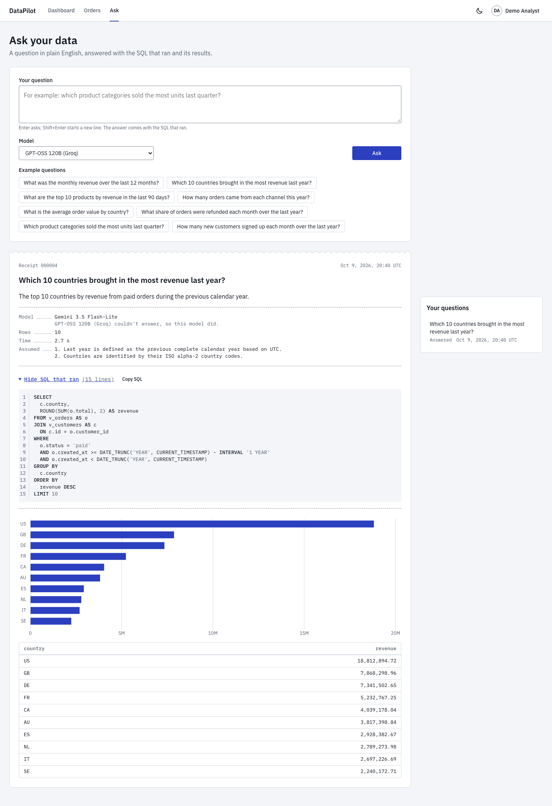
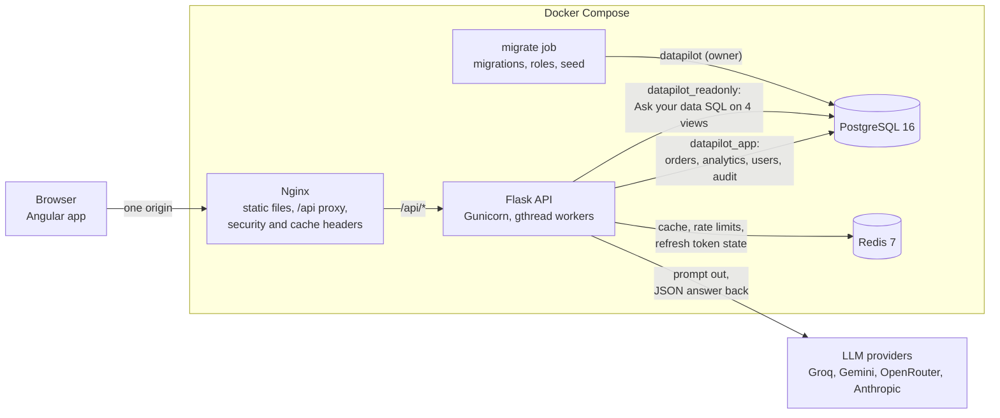

# DataPilot

An analytics app over two million e-commerce orders, with an "Ask your data" feature that turns a question in plain English into SQL that is checked, run read-only and shown with its results.

<picture>
  <source media="(prefers-color-scheme: dark)" srcset="docs/images/dashboard-dark.png">
  
</picture>

Flask 3 and SQLAlchemy 2 on Python 3.12, PostgreSQL 16, Redis 7, and an Angular app with signals and Chart.js, run with Docker Compose. The sales data is synthetic and deterministic: three years of orders with growth, seasonality, repeat customers and refunds.

## Try it in two minutes

Prerequisites: Docker with Compose, GNU Make and OpenSSL.

```bash
cp .env.example .env
make demo
```

Open <http://localhost:8080> and log in as `demo@datapilot.dev` with the password `DataPilot-demo-2026`.

- `make demo` builds the API and web images and starts PostgreSQL, Redis, a one-shot migration job, the API under Gunicorn and Nginx. It waits until every service is healthy: 30 to 40 seconds once the base images are downloaded.
- It loads the **small dataset** (50,000 orders), so it starts quickly for reviewers and CI.
- Without API keys, Ask your data uses a demo model that answers the example questions offline. Add a key (`GROQ_API_KEY`, `GEMINI_API_KEY`, `OPENROUTER_API_KEY` or `ANTHROPIC_API_KEY`) to `.env` and run `make demo` again to ask anything.
- `make demo-down` stops the stack, `make demo-reset` also deletes its data, and `make e2e-install && make e2e` runs the browser smoke test against it.

### With the full dataset

```bash
make demo scale=full
```

This loads the **full dataset**, 2,000,000 orders and 4.5 million order items, into the demo stack before the API starts. It takes about 2 minutes and about 2 GB of Docker disk, and it stops with a message if Docker's disk has less than 6 GB free. Running it again skips the load when the data is already there; a plain `make demo` keeps whatever data the stack holds, and `make demo-reset` goes back to the small dataset. The performance numbers below are from the full dataset.

## Features

- **Dashboard:** revenue, paid orders, average order value, active customers and refund rate for 7, 30 or 90 days against the previous period; monthly revenue with a 3-month average and month-over-month and year-over-year change; top customers by country; product ranking by category; retention by signup month as a heatmap. Every chart can also be read as a table.
- **Orders explorer:** filter 2 million orders by status, country, channel, customer, date range and total, sorted by date or total, with the filters in the URL. Paging stays as fast on page 40,000 as on page 1. Each order opens with its customer and items.
- **Ask your data:** pick a model (Groq, Google Gemini, OpenRouter, Anthropic, or the offline demo model) and ask a question. The answer is a receipt: the explanation, the assumptions, the model that answered, the exact SQL that ran, the rows and, when the shape fits, a chart. Refused and failed questions keep a receipt that says what happened.
- **Accounts:** registration, login, a session that survives reloads and browser restarts, and logout.
- **Light and dark themes**, keyboard navigation with visible focus, AA contrast, and reduced motion respected.

<picture>
  <source media="(prefers-color-scheme: dark)" srcset="docs/images/ask-dark.png">
  
</picture>

A real answer: the request to GPT-OSS 120B on Groq failed, so the app fell back to a model from another provider, and the receipt says so. More screenshots: [orders](docs/images/orders-light.png) ([dark](docs/images/orders-dark.png)), [an order](docs/images/order-light.png) ([dark](docs/images/order-dark.png)).

## Architecture



Nginx serves the Angular build and proxies `/api`, so the browser sees one origin: no CORS, and the refresh cookie stays `SameSite=Strict`. The API is layered (`api` → `services` → `repositories`; services never import Flask) and validates every request and response with Pydantic, which also generates the OpenAPI document. PostgreSQL is reached through three roles: the owner runs migrations, the API reads and writes rows, and model-written SQL runs as a role that can only read four curated views. Redis holds the analytics cache, rate limits and refresh-token state. [docs/architecture.md](docs/architecture.md) traces a request end to end and shows the Ask your data sequence.

## Engineering highlights

- **Keyset pagination with signed cursors.** Pages seek on `(created_at, id)` or `(total, id)` instead of using `OFFSET`, so the page after row 1,000,000 costs 0.18 ms in PostgreSQL instead of 303 ms. Cursors are HMAC-signed and bound to their filters, so a tampered or reused cursor gets a clear 400. [ADR 0005](docs/adr/0005-keyset-pagination.md)
- **Indexes chosen from measured plans.** Three indexes, each justified by an `EXPLAIN (ANALYZE, BUFFERS)` before and after: the first page went from a parallel scan of 2 million rows (p95 189 ms) to reading 26 index entries (now 4.4 ms). Two more indexes were built, measured and dropped as not worth their size. [performance.md](docs/performance.md)
- **Analytics in plain SQL with window functions.** `lag()` for month-over-month and year-over-year, a moving-average frame, `dense_rank()` per country, and cohorts over a month grid, in `.sql` files with named parameters and exact-number tests on hand-built data. Three queries were tuned from their plans, for example with extended statistics on an expression (492 → 152 ms) and a partial index for an index-only join (818 → 338 ms). [ADR 0006](docs/adr/0006-analytics-sql-and-caching.md)
- **Caching keyed by data version.** Cache-aside in Redis, with keys that include a data version the seed bumps, so a reload of the data invalidates everything without scanning keys. A stampede lock lets one request compute while the others wait, and the cache fails open while login rate limiting fails closed. Cached p95: 2.5 to 3.8 ms. [ADR 0006](docs/adr/0006-analytics-sql-and-caching.md)
- **Authentication.** A 15-minute access token kept in memory, and a refresh token in an httpOnly, `SameSite=Strict` cookie scoped to `/api/auth`, rotated on every use with reuse detection that revokes the whole token family. Double-submit CSRF, argon2 hashing, the same answer and timing for an unknown email as for a wrong password, and per-address and per-account login limits. [ADR 0003](docs/adr/0003-authentication-tokens.md)
- **Text-to-SQL that does not trust the model.** Each layer would stop a harmful query on its own: curated views without personal data, a database role that can only read them, a parser-based guard that regenerates the SQL it accepts, a read-only transaction with a timeout and a row limit on a protocol that refuses a second statement, per-user rate limits and an audit row for every question. Provider failures fall back to another provider; database errors get one repair attempt. GPT-OSS 120B and Gemini 3.5 Flash-Lite answered all 15 golden questions correctly. [ADR 0007](docs/adr/0007-text-to-sql-safety.md), [evaluation](docs/ai-evaluation.md)
- **Testing against the real thing.** 1,072 backend tests run on PostgreSQL and Redis, each inside a rolled-back transaction, at 100% line and branch coverage (the gate is 85%). They assert query counts to catch N+1 queries and test the read-only role with no guard in front of it. 593 frontend tests, and a Playwright smoke test against the production images in CI. [testing.md](docs/testing.md)
- **Production-shaped images.** Multi-stage builds (backend 74 MB, web 25 MB compressed), unprivileged containers with read-only file systems and no capabilities, a Content-Security-Policy that allows scripts from the origin only, JSON logs with request ids, and random secrets generated per machine. [ADR 0008](docs/adr/0008-production-images-and-demo-stack.md)
- **A deterministic seed at COPY speed.** A seeded generator streams 2 million orders and 4.5 million items into `COPY ... FREEZE` in about 100 seconds; the same seed and end date always give the same rows. [ADR 0004](docs/adr/0004-deterministic-seed-data.md)

## Performance

Measured on the **full dataset** (2,000,000 orders, 4,478,509 order items, 50,000 customers), not the small demo dataset: Apple M4 laptop, PostgreSQL 16 in Docker Desktop, Gunicorn with 2 workers of 4 threads, sequential requests over one connection after a warm-up, 2026-10-09.

| Request | p95 | Target |
| --- | ---: | ---: |
| `GET /api/orders`, first page | 4.4 ms | 150 ms |
| `GET /api/orders`, following `next_cursor` page after page | 3.5 ms | 150 ms |
| `GET /api/orders?country=DE&date_from=…` (last 90 days) | 4.9 ms | 150 ms |
| `GET /api/orders?customer_id=5880` (the busiest customer) | 3.7 ms | 150 ms |
| `GET /api/orders/{id}`, random ids | 3.3 ms | 150 ms |
| Analytics, uncached: summary, monthly revenue, top customers, products, cohorts | 61 to 479 ms | 800 ms |
| Analytics, cached (Redis) | 2.5 to 3.8 ms | 50 ms |

To reproduce on your machine (about 5 minutes):

```bash
cp .env.example .env
make up && make be-install && make db-upgrade && make db-roles
make seed scale=full
cd backend && uv run gunicorn --bind 127.0.0.1:5001 "app:create_app()"
make bench                               # in a second terminal
```

[performance.md](docs/performance.md) has every row, the query plans before and after each change, the indexes considered and rejected, and the worst filter combinations found. `make explain` and `make explain-analytics` print the plans on your database.

## API

The interactive documentation is at <http://localhost:8080/api/docs> in the demo stack, generated from the same Pydantic models that validate requests; the OpenAPI document is at `/api/openapi.json`. Lists return `{"items": [...], "next_cursor": ...}`, errors return `{"error": {"code", "message", "details", "request_id"}}`, money is a decimal string and timestamps are ISO 8601 UTC.

| Endpoint | Purpose |
| --- | --- |
| `POST /api/auth/register`, `/login`, `/refresh`, `/logout`; `GET /api/auth/me` | Accounts and sessions |
| `GET /api/orders` | Orders with filters (`status`, `country`, `channel`, `customer_id`, `date_from`, `date_to`, `min_total`, `max_total`), `sort`, `limit` and `cursor` |
| `GET /api/orders/{id}` | One order with its customer and items |
| `GET /api/analytics/summary` | Key numbers for the last `days`, against the previous period |
| `GET /api/analytics/revenue-monthly` | Monthly revenue with change and a 3-month average |
| `GET /api/analytics/top-customers` | Top customers by revenue, per country |
| `GET /api/analytics/products` | Product ranking with category shares |
| `GET /api/analytics/cohorts` | Retention by signup month |
| `GET /api/meta` | Filter values: countries, statuses, channels, categories, date range |
| `GET /api/ai/models`, `GET /api/ai/examples` | Enabled models and example questions |
| `POST /api/ai/ask` | Ask a question; returns the SQL that ran, the rows, the model and a chart suggestion |
| `GET /api/ai/history` | Your earlier questions |
| `GET /api/health`, `GET /api/ready` | Liveness, and readiness with PostgreSQL and Redis checks |

Every endpoint except health, readiness, the documentation, registration, login, refresh and logout needs a bearer token.

## Tests and checks

```bash
make up      # PostgreSQL and Redis for the backend tests
make check   # ruff, mypy --strict, pytest, ESLint, Prettier, Vitest, the production build, e2e type check
```

CI runs three jobs on every pull request: the backend (lint, types, tests with the coverage gate, dependency audit), the frontend (lint, tests with the coverage gate, production build, dependency audit), and the demo stack built from a clean checkout with the Playwright smoke test against it. [docs/development.md](docs/development.md) covers local development, the seed and every `make` target.

## Project structure

```
backend/
  app/
    api/            HTTP layer: blueprints, validation, auth decorators
    services/       business rules, no Flask imports
    repositories/   SQLAlchemy queries
    models/         SQLAlchemy models
    schemas/        Pydantic request and response models
    analytics/sql/  analytics queries as .sql files
    ai/             model registry, provider clients, prompt, SQL guard, executor
    seed/           deterministic data generator and COPY loader
  migrations/       Alembic migrations, reviewed by hand
  scripts/          benchmarks, EXPLAIN scenarios, model evaluation
  tests/            unit/ and integration/
frontend/src/app/
  core/             auth, HTTP, theme and other singletons
  features/         dashboard, orders, ask, auth
  shared/           chart, formatting and form pieces
e2e/                Playwright smoke test and screenshot script
infra/              Nginx and PostgreSQL configuration for the demo stack
docs/               architecture, ADRs, performance, testing, deployment, design
```

## Future work

- **Deployment.** A hosted demo, and the AWS deployment described in [deployment-aws.md](docs/deployment-aws.md). Before a first deploy to RDS, one committed migration needs a reviewed change: it names `NOSUPERUSER`, which only a superuser may do on PostgreSQL 16, and RDS has none.
- **Narrower database grants** for the API role, which can currently write every table.
- **HSTS** once the app is served over HTTPS, and Swagger UI's assets served locally instead of from a pinned CDN path.
- **Sessions:** an absolute session lifetime and "log out everywhere".
- **API documentation:** the 503 responses for outages and statement timeouts listed in every endpoint's OpenAPI entry.

## License

[MIT](LICENSE)
