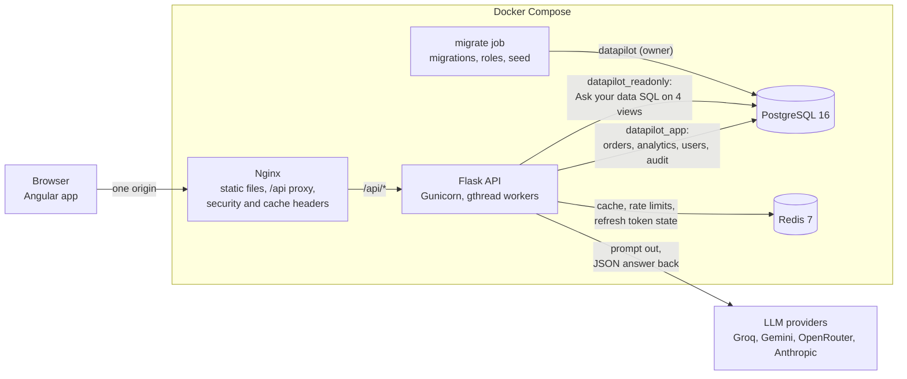
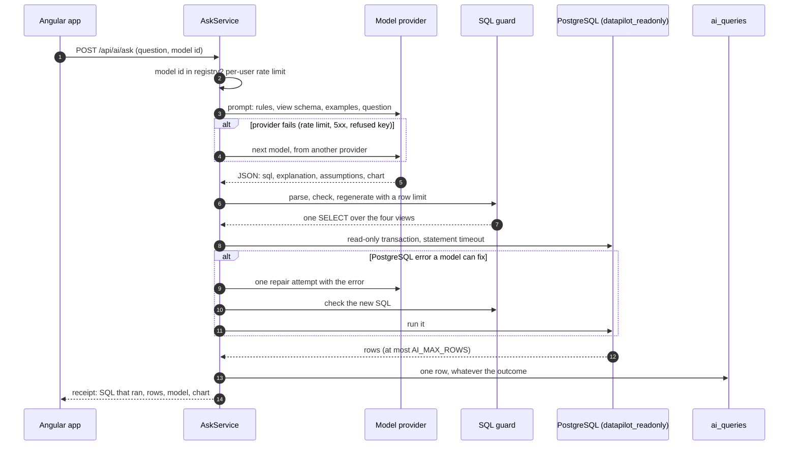

# Architecture

DataPilot is one Angular single-page app and one Flask API, with PostgreSQL for data and Redis for everything short-lived. This document shows how the parts fit together, what each one is responsible for, and where to look in the code. The reasons behind each choice are in the [ADRs](adr/).

## Components



| Component | Responsibility | Code |
| --- | --- | --- |
| Angular app | Dashboard, orders explorer, Ask your data. Keeps the access token in memory and lets the browser handle the refresh cookie. | `frontend/src/app/` |
| Nginx | Serves the built app, proxies `/api` to the API, sends the Content-Security-Policy and cache headers. The browser sees a single origin, so there is no CORS and the refresh cookie stays `SameSite=Strict`. | `frontend/Dockerfile`, `infra/nginx/` |
| Flask API | Every endpoint under `/api`, validated with Pydantic and documented in OpenAPI. Runs under Gunicorn with threaded workers, because requests mostly wait on PostgreSQL, Redis or a model provider. | `backend/app/`, `backend/gunicorn.conf.py` |
| migrate job | Runs once per start, before the API: migrations, the read-only role's password, and the seed when the database is empty. | `docker-compose.demo.yml` |
| PostgreSQL | Users, the sales data (2 million orders at full scale), the Ask audit log, and four curated views for model-written SQL. | `backend/migrations/` |
| Redis | Analytics response cache, rate-limit counters, refresh-token rotation and revocation. Every key has a TTL except the data version. | `backend/app/services/cache.py`, `rate_limiter.py`, `refresh_tokens.py` |
| LLM providers | Turn a question into SQL. Optional: without a key, a deterministic demo model answers the example questions. | `backend/app/ai/` |

In development, the same API runs with `make be-dev` on port 5001 and the Angular dev server on port 4200 forwards `/api` to it, so the browser still sees one origin.

## Database roles

| Role | Used by | Can |
| --- | --- | --- |
| `datapilot` | migrations and the seed (in the demo, the `migrate` job only) | everything |
| `datapilot_app` | the API in the demo stack | read and write rows; not create, alter or drop anything |
| `datapilot_readonly` | Ask your data only, through its own connection pool | `SELECT` on four views in the `analytics` schema, in read-only transactions with a statement timeout |

Development and CI use the owner for the API as well. The read-only role is the same everywhere, and a test logs in as it with no other protection and proves that writes, DDL and reads of the real tables are refused ([ADR 0007](adr/0007-text-to-sql-safety.md), [ADR 0008](adr/0008-production-images-and-demo-stack.md)).

## Backend layers

```
api/            HTTP only: parse and validate input, call a service, shape the response
services/       business rules; no Flask imports
repositories/   SQLAlchemy queries, one module per aggregate
models/         SQLAlchemy 2.0 mapped classes
schemas/        Pydantic request and response models (XCreate, XUpdate, XOut)
analytics/sql/  the analytics queries as .sql files with named parameters
ai/             model registry, provider clients, prompt, SQL guard, executor
seed/           deterministic data generator and COPY loader
```

Dependencies point inward: `api` imports `services`, `services` import `repositories`, and nothing below `api` knows about Flask. Services receive their collaborators (a session, a Redis client, a clock, an LLM client) in their constructors, which is what lets the tests replace the LLM with `FakeLLMClient` and pin the date.

Cross-cutting pieces sit at the top of `backend/app/`:

- `config.py`: one `Settings` object from environment variables; secrets are `SecretStr`, and production refuses weak or placeholder values.
- `errors.py`: an `AppError` hierarchy rendered in one place as `{"error": {"code", "message", "details", "request_id"}}`. PostgreSQL and Redis outages become `503 service_unavailable`.
- `logging.py`: JSON log lines, each with the request id that is also returned in `X-Request-ID`.
- `extensions.py`: the SQLAlchemy session (with a 3-second statement timeout per request), the read-only engine, Redis, JWT.

## A request, end to end

`GET /api/orders?country=DE&limit=25` in the demo stack:

1. **Nginx** matches `/api/`, appends the client address to `X-Forwarded-For` and proxies to Gunicorn.
2. **Flask** assigns a request id; `ProxyFix` trusts exactly one proxy hop, so rate limits see the real client.
3. **spectree** validates the query string against `OrderListQuery` (unknown parameters are refused) and the access token is checked from the `Authorization` header only.
4. **`OrdersService`** verifies the cursor's signature and that it was issued for the same filters and sort, then asks **`OrdersRepository`** for `limit + 1` rows with a keyset condition on `(created_at, id)` ([ADR 0005](adr/0005-keyset-pagination.md)). The page and its customers come back in one query; lazy loading is disabled, so an N+1 would fail a test.
5. The extra row decides `next_cursor`; the response is validated against `OrderPageOut`, money is serialized as decimal strings and timestamps as ISO 8601 UTC.
6. One access log line records method, path, status, duration and request id.

Analytics requests take the same path, with a Redis cache-aside step keyed by the data version in front of the SQL file ([ADR 0006](adr/0006-analytics-sql-and-caching.md)).

## Ask your data



The model's reply is treated as untrusted input: the guard, the role and the read-only transaction would each stop a harmful query on their own. A refused or failed question still returns a receipt with what happened ([ADR 0007](adr/0007-text-to-sql-safety.md)).

## Frontend

```
src/app/core/       singletons: API error handling, auth service, interceptor and guards,
                    theme, page titles, toasts
src/app/features/   one folder per screen: auth, dashboard, orders, ask, not-found
src/app/shared/     presentational pieces: the Chart.js wrapper, formatting, form helpers
src/styles/         design tokens as CSS custom properties, light and dark
```

Components are standalone with `OnPush` change detection; state lives in small signal-based stores per feature; HTTP goes through typed services whose models mirror the backend's `Out` schemas. The auth interceptor attaches the access token, and on a 401 it refreshes once for all requests that failed at the same moment, then retries them. Chart.js is loaded lazily, only when a chart scrolls into view. The design system is described in [design.md](design.md).

## Configuration and secrets

All configuration comes from environment variables (`.env.example` lists them). The demo stack generates its own random secrets into the untracked `.env.demo` on first start; model API keys are read from `.env` and are optional. A provider appears in the model list only when its key is set.

## Further reading

- [performance.md](performance.md): measurements, query plans and indexes.
- [testing.md](testing.md): how the tests are organised and what they prove.
- [deployment-aws.md](deployment-aws.md): how the same images would run on AWS.
- [ai-evaluation.md](ai-evaluation.md): the enabled models compared on 15 golden questions.
