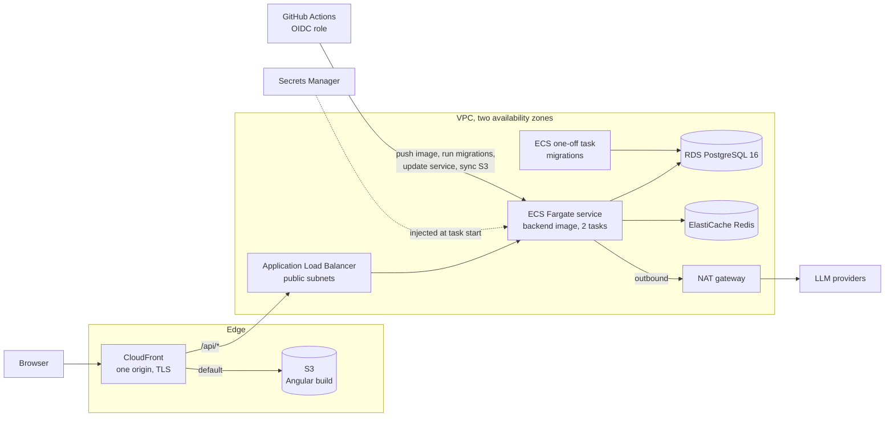

# Deploying to AWS

How the images and configuration in this repository would run on AWS, for a small production deployment or a public demo. Nothing here is provisioned by the repository: it is a plan a reviewer can check against the code, with the decisions that matter and a rough monthly cost. It has not been deployed.

## Target architecture



| Local piece | On AWS | Why |
| --- | --- | --- |
| Nginx serving the Angular build | S3 bucket behind CloudFront, private through Origin Access Control | Static files need no server. CloudFront caches them at the edge and terminates TLS. |
| Nginx proxying `/api` | A CloudFront behavior for `/api/*` to the load balancer | The browser still sees one origin, so there is no CORS and the refresh cookie stays `SameSite=Strict` ([ADR 0003](adr/0003-authentication-tokens.md)). |
| `backend` container | ECS Fargate service with the same image, behind an Application Load Balancer | No servers to patch; the image already runs as an unprivileged user with a health check ([ADR 0008](adr/0008-production-images-and-demo-stack.md)). |
| `migrate` job | A one-off ECS task with the same image, run by the deploy before the service is updated | Migrations run once per deploy, never by several API tasks at once. |
| PostgreSQL container | RDS for PostgreSQL 16 | Backups, point-in-time recovery, minor version patching. |
| Redis container | ElastiCache (Redis OSS or Valkey), one small node | The app uses Redis for a cache, rate limits and refresh-token state; every key except the data version has a TTL. |
| `.env.demo` | Secrets Manager, injected into the task as environment variables | `Settings` reads configuration from the environment, so the code does not change. |

## Decisions and details

### CloudFront in front of everything

- **Behaviors:** the default behavior serves S3 with caching. `/api/*` goes to the load balancer with caching disabled, all methods allowed, and the `Authorization` header, query strings and cookies forwarded (the managed `AllViewerExceptHostHeader` origin request policy).
- **Client routes:** a CloudFront Function rewrites requests without a file extension to `/index.html`. Custom error responses (403 or 404 → `index.html`) would also turn a real API 404 into an HTML page, which the app would then fail to parse.
- **Headers:** a response headers policy carries the Content-Security-Policy and the other headers that `infra/nginx/security-headers.conf` sets today, plus HSTS, which the local demo cannot send over plain HTTP.
- **Caching:** the deploy uploads hashed files with `Cache-Control: public, max-age=31536000, immutable` and `index.html`, `theme.js` and `favicon.svg` with `no-cache`, as Nginx does now, then invalidates `/index.html`.

### Client addresses and the load balancer

CloudFront adds the viewer's address to `X-Forwarded-For` and the load balancer appends CloudFront's, so the API trusts two hops: `TRUSTED_PROXY_HOPS=2`. That is only safe if nobody can reach the load balancer directly, because a direct client would then choose its own address for the rate limiter. The load balancer's security group therefore allows only the CloudFront origin-facing managed prefix list, and a listener rule requires a secret header that CloudFront adds to origin requests; anything else gets a 403.

### Network

- The load balancer sits in public subnets; the API tasks, RDS and ElastiCache in private subnets with no public addresses.
- The API needs outbound internet access to reach the model providers, which a NAT gateway provides. One gateway in one zone is the cheapest option, at the cost of losing outbound calls (only Ask your data) if that zone fails.
- Security groups chain: load balancer → API on port 8000; API and the migration task → RDS on 5432 and ElastiCache on 6379. Nothing else reaches the data stores.

### The API service

- Task size 0.5 vCPU and 1 GB on ARM (Graviton), two tasks across two zones. The backend image would be built for `linux/arm64`; its base images are multi-architecture already.
- `GUNICORN_WORKERS=2` and `GUNICORN_THREADS=4`, as in the demo; the container listens on 8000. The target group checks `/api/health`, which tests only the process. ECS replaces tasks that fail the load balancer's check, so pointing it at `/api/ready`, which also checks PostgreSQL and Redis, would restart every task during a Redis outage that a restart cannot fix. The deploy workflow calls `/api/ready` once after a deployment instead.
- The deployment circuit breaker with rollback is on, so a task that never becomes healthy rolls the service back to the previous task definition.
- Logs go to CloudWatch Logs through the `awslogs` driver. They are already one JSON object per line, with the request id.

### Database

- RDS PostgreSQL 16, `db.t4g.small` (2 GB of memory), 20 GB of gp3 storage, automated backups for 7 days, encryption at rest, single zone for a demo and Multi-AZ for production. The full dataset takes about 0.9 GB of tables and indexes.
- **Roles.** As in the demo stack: the master user owns the schema and runs migrations from the one-off task; the API connects as `datapilot_app`, created once with the statements in `infra/postgres/demo/01-create-app-role.sh`; Ask your data connects as `datapilot_readonly`, whose password `flask db-roles` sets on every deploy.
- **Known blocker, not yet tested on RDS.** RDS's master user is a member of `rds_superuser`, not a superuser. Migration `6e5cbd81682d` runs `ALTER ROLE datapilot_readonly NOSUPERUSER ...`, and PostgreSQL 16 lets only a superuser name the `SUPERUSER` attribute, even to leave it unchanged (Stage 11 hit the same rule with a non-superuser owner). A first `flask db upgrade` on RDS is therefore expected to fail at that statement. Committed migrations are not edited, so the fix needs a decision before a first deploy, for example a reviewed amendment that skips the statement when the role already has those attributes (a role created with `CREATE ROLE` has all of them by default), recorded in a new ADR.
- The seed is not part of a deploy. A demo database is seeded once with a one-off task running `flask seed --scale full --yes`; a real deployment would load its data some other way.

### Secrets

One Secrets Manager secret per value: `SECRET_KEY`, `JWT_SECRET_KEY`, the three database URLs (owner, app, read-only), and each model provider's key. The task definition's `secrets` section maps them to environment variables, so they never appear in the task definition, the image or the logs. The task execution role may read exactly these secrets; the task role itself needs no AWS permissions at all. The master password can be managed by RDS in Secrets Manager with rotation; rotating the app or read-only password means updating the secret and redeploying.

### Deploying from GitHub Actions with OIDC

No long-lived AWS keys are stored in GitHub. An IAM OIDC identity provider for `token.actions.githubusercontent.com` lets a workflow assume a deploy role, whose trust policy accepts only this repository's `main` branch (or a `production` environment with required reviewers):

```json
"Condition": {
  "StringEquals": {
    "token.actions.githubusercontent.com:aud": "sts.amazonaws.com",
    "token.actions.githubusercontent.com:sub": "repo:<owner>/datapilot:ref:refs/heads/main"
  }
}
```

The deploy workflow runs after CI succeeds on `main`, with `permissions: id-token: write`:

1. `aws-actions/configure-aws-credentials` assumes the deploy role.
2. Build the backend image for `linux/arm64` and push it to ECR, tagged with the commit SHA, with scan on push enabled.
3. Register a task definition with the new image, and run it once as the migration task with the command `flask db upgrade && flask db-roles`. Stop if it does not exit with 0.
4. Update the ECS service to the new task definition and wait until it is stable; the circuit breaker rolls back a failed deployment. Then check that `/api/ready` answers 200 through CloudFront.
5. Build the Angular app, sync it to S3 with the cache headers above, and invalidate `/index.html` in CloudFront.

The deploy role can push to the one ECR repository, register task definitions, run tasks and update the one service, pass only the two task roles, write to the one bucket and invalidate the one distribution. Migrations must stay backward compatible with the running version (expand, then contract), because step 3 runs while the old tasks still serve traffic.

## Rough monthly cost

US East (N. Virginia), on-demand, 730 hours a month, for the layout above with low traffic. Prices were taken from the AWS pricing pages on 2026-10-09; the RDS and ElastiCache node prices are from a third-party price list of AWS's published rates, because the AWS pages show them only in interactive tables. Check the AWS Pricing Calculator before relying on these numbers.

| Item | Size | Price | Per month |
| --- | --- | --- | ---: |
| ECS Fargate, API | 2 tasks × 0.5 vCPU, 1 GB, ARM | $0.03238 per vCPU-hour, $0.00356 per GB-hour | $28.84 |
| RDS PostgreSQL | `db.t4g.small`, single zone, 20 GB gp3 | about $0.032 per hour, $0.115 per GB-month | $25.66 |
| ElastiCache | `cache.t4g.micro`, one node | about $0.016 per hour | $11.68 |
| Application Load Balancer | 1, about 1 LCU | $0.0225 per hour, $0.008 per LCU-hour | $22.27 |
| NAT gateway | 1, little data | $0.045 per hour, $0.045 per GB | $32.85 |
| Public IPv4 addresses | 2 for the load balancer, 1 for the NAT gateway | $0.005 per hour each | $10.95 |
| Secrets Manager | about 7 secrets | $0.40 per secret | $2.80 |
| CloudFront, S3, ECR, CloudWatch Logs | demo traffic, a few GB of logs | mostly within the free allowances | about $5 |
| **Total** | | | **about $140** |

- **Cheaper demo (about $95):** one API task (saves about $14), and the API in a public subnet with a public address and a security group that admits only the load balancer, instead of a NAT gateway (saves about $33). The second change gives up the private-subnet boundary.
- **Production:** Multi-AZ RDS doubles its line, and a NAT gateway per zone adds about $33 each.
- **Other regions** typically cost 10 to 15% more than US East (N. Virginia).
- **Model providers** are billed by each provider, not AWS. The demo can run on the demo model alone, or on a free tier with a strict spend limit.
